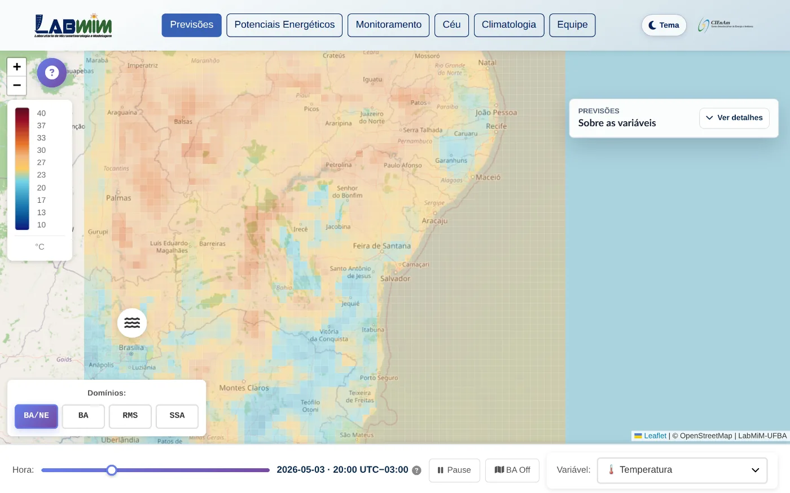
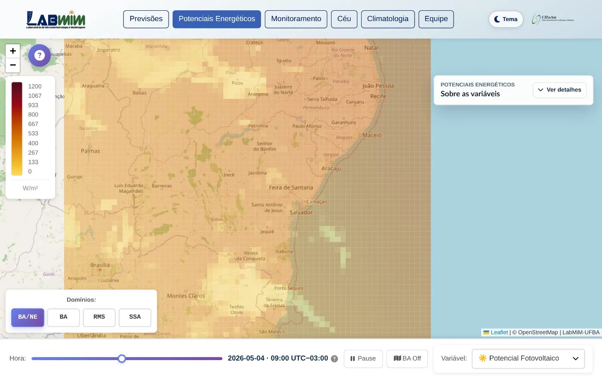
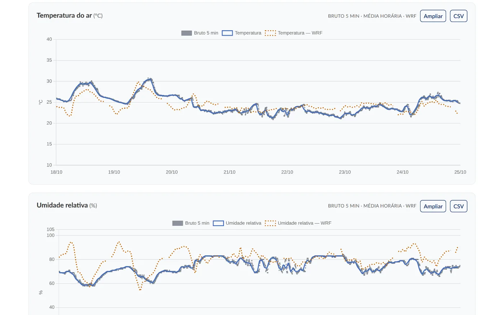
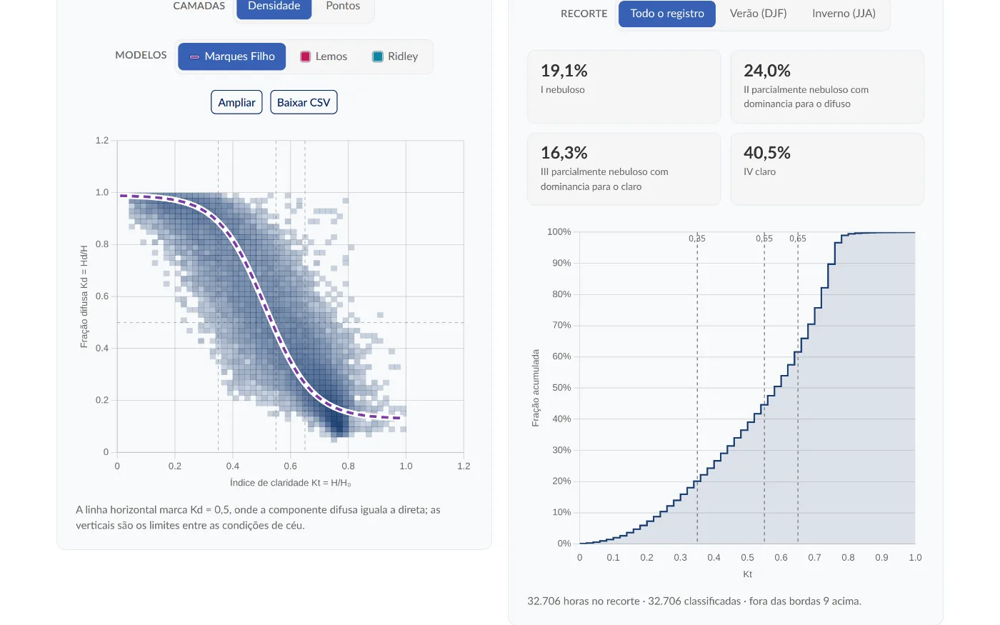
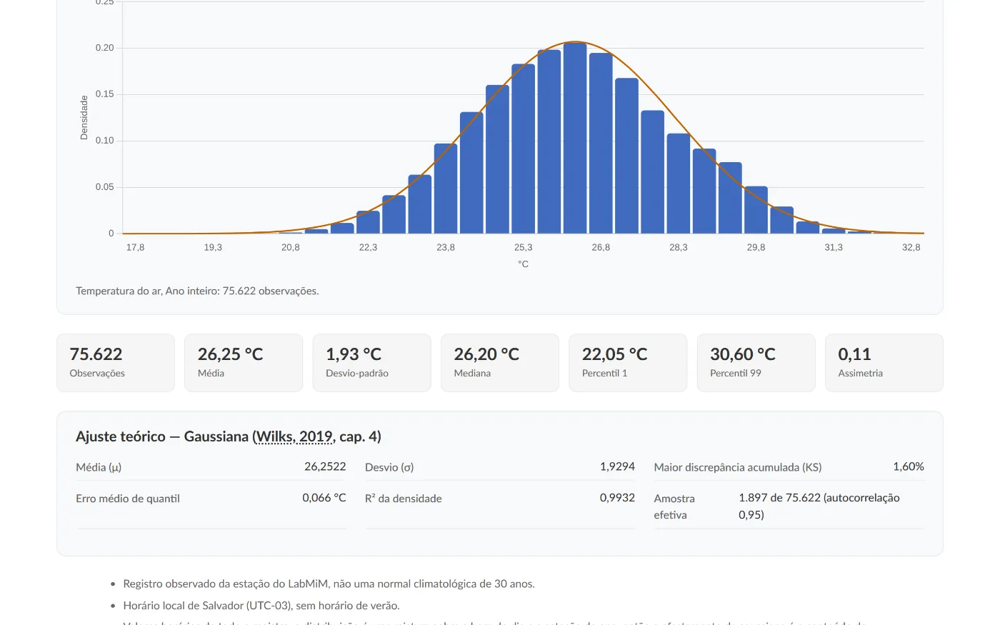
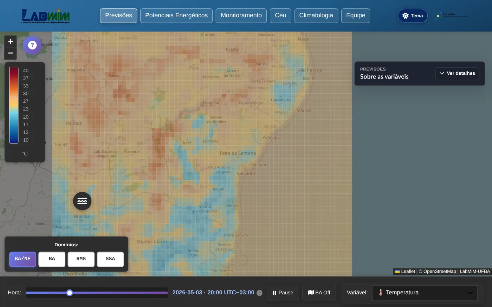

# Sites LabMiM / LEAL

[](https://github.com/Bruno-Mascarenhas/site-labmim/actions/workflows/ci.yml)
[](LICENSE)
[](https://labmim.if.ufba.br/)

Gerador de sites estáticos para publicações meteorológicas de laboratórios universitários — hoje **LabMiM/UFBA**, no ar em <https://labmim.if.ufba.br/>, e **LEAL/UFES** —, preparado para incorporar outros estados e instituições sem duplicar a aplicação. Cada publicação reúne páginas institucionais e os WebGIS de previsões meteorológicas e potenciais energéticos derivados do modelo WRF; monitoramento ambiental, condição do céu e climatologia entram onde o laboratório tem estação e câmera próprias. A saída é HTML, CSS e JavaScript puros, sem backend, sem Node no servidor e sem CDN no caminho crítico; a arquitetura completa está em [Architecture.md](Architecture.md).

Os dados dos mapas (`site/JSON/` e `site/GeoJSON/`) **não são gerados aqui**: eles vêm do pipeline WRF do repositório irmão [micrometeorology](https://github.com/Bruno-Mascarenhas/micrometeorology) — ver [De onde vêm os dados](#de-onde-vêm-os-dados).



_WebGIS de previsões: campo de temperatura do WRF sobre a Bahia e o Nordeste, com seletor de domínio (BA/NE, BA, RMS, SSA), escala de cores e linha do tempo dirigida pelo manifesto da rodada._

## O que o site publica

Tudo abaixo é arquivo estático: não há backend consultando nada em runtime, só JSON e imagens que o deploy deposita nos caminhos do dataset.

**Previsões meteorológicas.** A imagem acima: as variáveis da rodada do WRF — temperatura, vento, radiação, precipitação, pressão e umidade —, em quatro domínios aninhados de 27 km a 1 km, com série temporal ao clicar em qualquer célula.

**Potenciais energéticos.** Os mesmos campos do WRF convertidos em potencial fotovoltaico, potencial eólico e densidade eólica a 10 m.



_WebGIS de potenciais energéticos: potencial fotovoltaico em W/m², sobre a mesma base de mapa e os mesmos domínios das previsões._

**Monitoramento da estação.** A janela de sete dias da estação do laboratório, em três camadas sobrepostas.



_Monitoramento da estação: temperatura do ar e umidade relativa em três camadas — amostras brutas de 5 min, média horária e WRF —, com ampliação e exportação em CSV._

**Condição do céu.** O quadro vivo da câmera all-sky com o mapa de sensibilidade à oclusão da rede sobreposto, a previsão de difusa e de condição do céu com os contrafactuais sem imagem, a linha do tempo dos últimos dias, o cartão do modelo servido (métricas de teste contra controles e referências) e o plano do índice de claridade Kt contra a fração difusa Kd.



_Condição do céu: densidade horária de Kt × Kd com a curva de Marques Filho et al. (2016) e a sobreposição opcional de Lemos et al. (2017) e do BRL de Ridley et al. (2010); ao lado, a curva acumulada de Kt e as quatro condições de céu de Escobedo et al. (2009) — 32.706 horas classificadas na captura._

**Climatologia da estação.** As distribuições observadas do registro, com a densidade teórica ajustada e a bibliografia vinda do próprio manifesto.



_Climatologia: histograma de temperatura do ar com ajuste gaussiano (75.622 observações na captura) e as estatísticas de aderência publicadas junto dos dados._

**Tema claro e escuro.** Vale para todas as páginas: o tema é escolhido pelo leitor, persistido no navegador e propagado aos gráficos sem recarregar a página.



_O mesmo WebGIS no tema escuro: a preferência fica no navegador e os gráficos se reajustam junto._

Cada publicação traz ainda as páginas institucionais — início e equipe —, com identidade visual e SEO próprios.

Quais dessas páginas existem é decidido publicação a publicação, no `pages.js` de cada uma. A UFBA publica as sete — as cinco de dados acima, mais início e equipe. O LEAL, que não tem câmera all-sky própria, publica as institucionais, os dois WebGIS, o monitoramento e a climatologia da estação dele, e um terceiro WebGIS, o de médias anuais do WRF, que mostra a média de cada hora local do dia e a cobertura do ano; por enquanto ele roda sobre dados de teste e fica fora do sitemap.

## Como rodar localmente

Não abra as páginas por `file://`. Os mapas e os workers dependem de `fetch`, então é preciso servir por HTTP local.

```bash
nvm use      # Node 24, fixado em .nvmrc
npm ci
```

Liste as publicações descobertas e gere a desejada antes de servir:

```bash
npm run sites:list             # lista os src/sites/<id>/site.js e marca o padrão
npm run build                  # publicação padrão em site/
npm run build -- --site=ufba   # publicação específica em site/
npm run build -- --site=ufes
```

Edite sempre `src/`: as páginas de `site/` e todo o `dist/` são saída gerada, e o próximo build sobrescreve qualquer edição feita à mão neles. Nem todo o `site/assets/` é gerado — parte dele é fonte e se edita normalmente; a fronteira exata está em [O que não se edita à mão](CONTRIBUTING.md#o-que-não-se-edita-à-mão).

```bash
make serve                     # serve site/ em http://localhost:8000
```

Sem `make`, o equivalente cru é `cd site && python3 -m http.server 8000`. Se a porta 8000 estiver ocupada, use outra (ex.: `python3 -m http.server 8100`). Confira:

- <http://localhost:8000/>
- <http://localhost:8000/mapas_interativos.html>
- <http://localhost:8000/potenciais_energeticos.html>
- <http://localhost:8000/ceu.html>

A publicação seleciona o **frontend**; ela não converte dados operacionais — cada deploy precisa receber, nos caminhos do seu dataset, a rodada WRF e o acervo daquela instituição (ver [De onde vêm os dados](#de-onde-vêm-os-dados)).

Antes de abrir um pull request, `make ci` roda a mesma bateria do CI: build de todas as publicações, verificação de formatação, linters e auditoria de dependências.

A lista completa dos scripts npm e dos atalhos do `Makefile` está em [CONTRIBUTING.md](CONTRIBUTING.md#comandos).

## De onde vêm os dados

Os campos do WebGIS (`site/JSON/`, `site/GeoJSON/`, `site/MediasAnuais/`) são produzidos pelo pipeline WRF do repositório irmão [micrometeorology](https://github.com/Bruno-Mascarenhas/micrometeorology), **nunca por este build**. O acervo do laboratório (`site/Ceu/`, `site/Climatologia/`, `site/Monitoramento/`) vem da câmera all-sky e dos sensores da estação.

**Nenhum desses dados é versionado**: o git rastreia apenas o `.keep` que mantém cada diretório, e quem entrega o conteúdo é o deploy. Não abra, varra, formate nem reprocesse esses caminhos em manutenção comum — são arquivos grandes, gerados fora daqui, e mexer neles não conserta nada do lado do site.

O site **degrada graciosamente** quando eles faltam: sem manifest usa o intervalo declarado pelo dataset, sem `grid.json` cai no `.geojson`, sem os artefatos consolidados volta à varredura hora-a-hora. Por isso o site novo funciona sobre dados antigos, e essa é a ordem segura numa mudança de formato: publicar o site primeiro e só então atualizar o pipeline — o inverso não é garantido (ver [Deploy em produção](Architecture.md#deploy-em-produção)).

- [Contratos de dados](Architecture.md#contratos-de-dados) — cada arquivo que o site consome, formato a formato.
- [Produtor dos dados](Architecture.md#produtor-dos-dados) — a CLI `mm-wrf-geojson` que os gera, com fuso, paralelismo e entry points.
- [O que não se edita à mão](CONTRIBUTING.md#o-que-não-se-edita-à-mão) — a fronteira entre o que é fonte e o que é entregue.

## Onde está o resto

Este README é o ponto de partida; o detalhe vive nos documentos abaixo.

| Documento                                                        | O que responde                                                                                                                                  |
| ---------------------------------------------------------------- | ----------------------------------------------------------------------------------------------------------------------------------------------- |
| [`Architecture.md`](Architecture.md)                             | A arquitetura completa: organização de pastas, contratos de dados, runtime do WebGIS, `.htaccess`, deploy em produção e checklist de validação. |
| [`CONTRIBUTING.md`](CONTRIBUTING.md)                             | O fluxo de issue, branch e pull request, os comandos npm e do `Makefile`, e o que não se edita à mão.                                           |
| [`src/sites/README.md`](src/sites/README.md)                     | Como criar uma publicação, uma página, um território ou um dataset — e as fronteiras entre esses módulos.                                       |
| [`docs/onboarding-architecture/`](docs/onboarding-architecture/) | Os dois PDFs de onboarding — a plataforma e o guia de contribuição —, sua fonte e como regenerá-los.                                            |
| [`scripts/subset-fontawesome.md`](scripts/subset-fontawesome.md) | Como regenerar o subset da fonte do Font Awesome quando entra um ícone novo.                                                                    |

O deploy é manual: publica-se o site completo junto do `.htaccess`, nunca o `.htaccess` sozinho sobre uma versão antiga. As regras aprendidas em produção — ordem segura para mudança de formato, rollback do pipeline e o `mod_pagespeed` do host — estão em [Deploy em produção](Architecture.md#deploy-em-produção).

## Licença

O código deste repositório está sob a [Licença MIT](LICENSE): qualquer pessoa pode usar, copiar, modificar e redistribuir — inclusive em fork ou em uso comercial — sem pagar nada, desde que **mantenha o aviso de copyright e a licença** e cite este repositório como origem.

A permissão cobre o gerador estático e o template. Ela **não** transfere direitos sobre marcas e identidade institucional (logos e nomes de LabMiM/UFBA, LEAL/UFES e parceiros, em `src/sites/<id>/assets/`) nem sobre os dados operacionais publicados em produção (`site/JSON/`, `site/GeoJSON/`, `site/MediasAnuais/`, `site/Climatologia/`, `site/Monitoramento/`, `site/Ceu/`, `site/assets/graphs/`), que pertencem às instituições correspondentes — os do WebGIS vêm do pipeline [micrometeorology](https://github.com/Bruno-Mascarenhas/micrometeorology), os demais do acervo de sensores e da câmera all-sky do laboratório. Um fork deve substituir ambos pela própria identidade e pelos próprios dados. As bibliotecas vendorizadas em `site/assets/vendor/` mantêm suas licenças originais (Bootstrap, Leaflet, Chart.js e Font Awesome).
